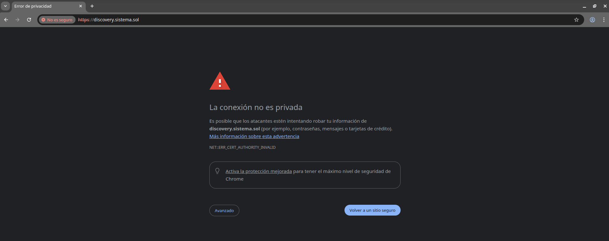
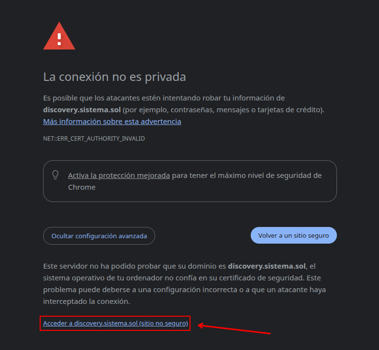

# Weblab 04: Secure server

This project consists of configuring a secure server using the HTTPS protocol in Apache, using self-signed certificates for the domain `discovery.sistema.sol`.

## Objective
Configure secure access (port 443) and verify the correct implementation of SSL/TLS encryption on the previously virtualized network infrastructure.

## Configuration Steps

### 1. Generating the Self-Signed Certificate
The `openssl` tool was used to generate a private key and a certificate valid for 365 days:
```bash
sudo openssl req -x509 -nodes -days 365 -newkey rsa:2048 \
  -keyout /etc/ssl/private/apache-selfsigned.key \
  -out /etc/ssl/certs/apache-selfsigned.crt
```
[COMMAND](./images/command.png)

### 2. Create the configuration file
Next, once the certificate has been generated and the certificate (.crt) and key (.key) have been entered in the `/etc/ssl` directory, we configure the configuration file, which we have named **discovery-ssl.conf**.
[CONFIGURATION_FILE](./images/conf_file.png)

### 3. Enable module/site
Enable the SSL module:
```bash
sudo a2enmod ssl
```

Enable the site:
```bash 
sudo a2ensite discovery-ssl.conf
```

Restart Apache: 
```bash 
sudo systemctl restart apache2
```

### 4. Verifications
To verify that the secure server is working correctly, the following tests have been performed:

###  1. Self-Signed Certificate Validation
When accessing the URL `https://discovery.sistema.sol` via HTTPS, the browser identifies that the certificate does not come from a known certification authority. When inspecting the details, it is confirmed that the certificate was issued by and for `discovery.sistema.sol` as configured with OpenSSL.



### 2. Access to the Secure Website
We click on advanced options and tell it that we want to access the page even though it is not secure.
Once the security exception is accepted, the site content can be viewed. Verify that the address bar displays the `https://` protocol.


